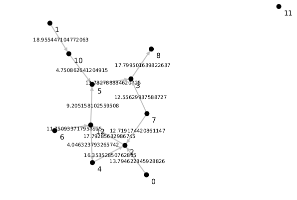
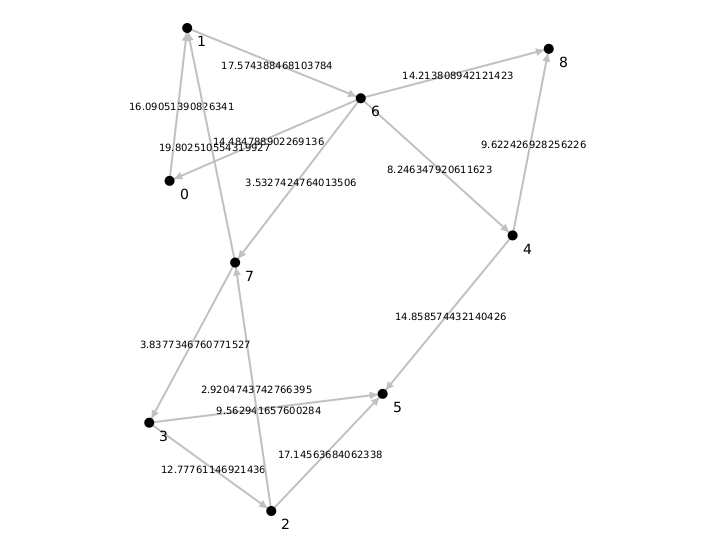
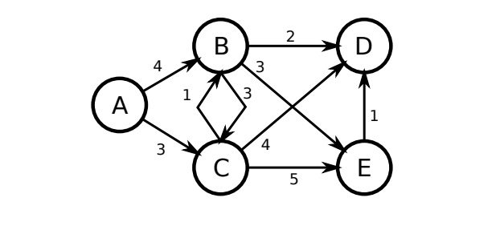
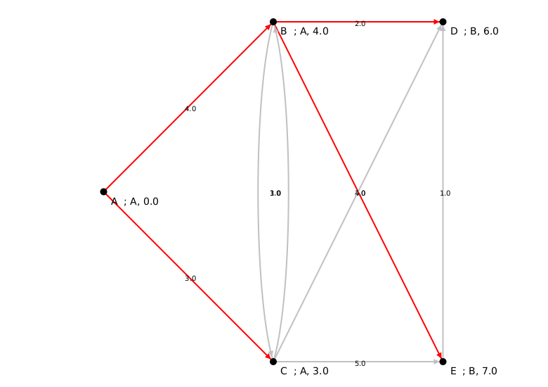
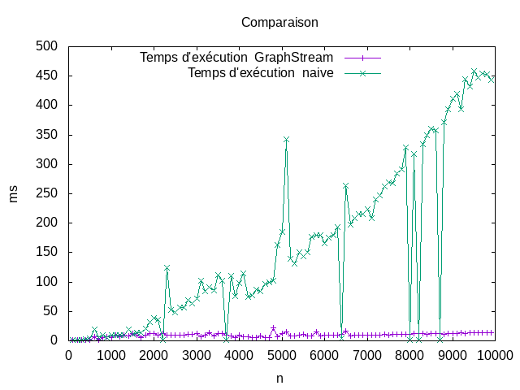

# TP 3 Plus court chemain

# Introduction :
Dans ce tp , on doit implémenter une version naïve de l'algorithme Dijkstra ,afin de tester son efficacité on doit procéder à une campagne de test sur cet algorithme et le comparer à des tests effectués sur l’algorithme Dijkstra de GraphStream . Au premier temps on générera un graphe à l’aide de générateur de GraphStream , on lance les deux algorithmes et on mesure leur temps d'exécution sur des déférents taille et degré de graphe .Et ensuite on répète les comparaison sur des graphes différents..


## Génération des graphes simples en utilisant random graph genrator
   


###  Générateur GraphStream  :
### Générateur de graphe aléatoire :

GraphStream propose un générateur de graphe aléatoire , cette méthode prend en paramètre le nombre de noeuds et un degré moyen sur chaque noeud .Dans mon programme j'ai implémenté une méthode
genereRandomGraph qui crée un graphe de n noeuds et d'un degré moyen et passe un attribut Poids.Ensuite elle retourne ce graphe Aléatoire .


```java
    private static Graph genereRandomGraph(int n, double averageDegree) {

                Graph graph = new SingleGraph("Random graphe");
                RandomGenerator gen = new RandomGenerator(averageDegree);
                gen.setDirectedEdges(true, true);
                gen.addSink(graph);
                gen.addEdgeAttribute("Poids");
                gen.begin();
                for (int i = 0; i < n; i++)
                    gen.nextEvents();
                gen.end();
        
                graph.edges().forEach(e -> e.setAttribute("Poids", (double) Math.abs(Math.random() * 20) + 1));
        
                return graph;
```


# Implémentation de  l' algorithme Dijkstra Naive : 
L'algorithme utilisé dans ce programme est celui proposé dans le cours . Au départ ,on initialise les distances de chaque à l'infini et les parents de chaque nœud a null. Ensuite on met la distance de noeud source à 0 . On crée une file HashMap afin de stocker les nodes voisins et leur distance .En premier temps on ajoute le nœud source car c'est qui possède une distance minimale .
Ensuite , tant que la file n'est pas vide ,on récupère le nœud de distance minimum stocker dans cette file à l'aide de la méthode extractMin() ,cette dernière récupère le nœud de distance minimum et le supprime . À partir de ce noeud on parcours ses voisins et si la distance de ce noeud + le poids de l'arc entre lui et son voisin est inférieure à l'ancienne distance enregistrer sur son attribut distance de voisin ,on mettra à jour cette distance (noeud voisin) par la nouvelle distance et son parent par le noeud courant (père) sinon on ne le mets pas à jour . Si on a fait une mise à jour sur un voisin ,on devra aussi l'ajouter dans la file ou s' il existe on remplace sa distance , c'est la raison pour laquelle j'ai créé la méthode addOrReplace().

#### La procédure utilisée
```java

Procédure Dijkstra(G,s)
v.dist ← ∞
v.parent ← null pour v ∈ V
s.dist ← 0
f.init()
f.add(s, 0)
TantQue non f.empty() Faire
u ← f.extractMin()
Pour (u, v) ∈ E Faire
Si v.dist > u.dist + wuv Alors
v.dist ← u.dist + wuv
v.parent ← u
f.add(v, v.dist)
FinSi
FinPour
FinTantQue
FinProcédure

```


#### L'implémentaion 
```java 
public void computeDijkstra() {
        //initialisation sur chaque sommet disance = infinie , parent = null
        this.g.forEach(v -> {
            v.setAttribute("Parent", (Object) null);
            v.setAttribute("Distance", Double.POSITIVE_INFINITY);
        });

        //initialisation de la source
        g.getNode(this.source.getId()).setAttribute("Distance", 0.0);
        g.getNode(this.source.getId()).setAttribute("Parent", this.source);


        //creation de file priorité
        this.f = new HashMap<>();
        f.put(this.source, 0.0);
        Node current;

        //  Iterator<Node> i ;
        Iterator<? extends Node> i;

        while (!f.isEmpty()) {
            // récupère l’élément de priorité minimum
            current = extrMin();
            i = current.neighborNodes().iterator();
            // on caclule sa distance vers ses voisins
            while (i.hasNext()) {

                Node next = i.next();
                Double distance = (Double) current.getEdgeBetween(next).getAttribute("Poids") + (Double) current.getAttribute("Distance");

                // ajoute l’élément e de priorité p ou modifie sa priorité.
                if ((Double) next.getAttribute("Distance") > distance) {
                    next.setAttribute("Distance", (Double) distance);
                    next.setAttribute("Parent", current.getId());
                    addOrReplace(next, distance);
                }
            }
        }

    }
```

## Résultat de test de l'DijkstraNaive sur l'exemple de cours :
  
Afin d'assurer que l'algorithme est correct , je l'ai testé sur l'exemple de cours et récupérer le plus cours chemin entre la racine et touts les autres noeud.


   
La méthode getPath récupère le chemin entre le nœud source et un autre nœud v ,en commençant par le nœud v tant que on est pas arriver au nœud source on cherche son parent . On modifie la couleur de l'arc entre un père et un fils , une liste de plus court chemin aussi ajouter afin de les afficher dans la console mais inverser c'est-à-dire de la destination à la source.

```java
 public List<Node> getPath(Node toNode) {

        Node parent = this.g.getNode("" + toNode.getAttribute("Parent"));
        ArrayList<Node> path = new ArrayList<>();
        path.add(toNode);

        path.add(parent);
        toNode.getEdgeBetween(parent).setAttribute("ui.style", "fill-color: red;");


        while (!parent.equals(this.source)) {
            parent.getEdgeBetween(this.g.getNode("" + parent.getAttribute("Parent"))).setAttribute("ui.style", "fill-color: red;");
            parent = this.g.getNode("" + parent.getAttribute("Parent"));

            path.add(parent);
        }

        return path;


    }
```
La méthode getPathAll affiche tous les chemins entre la racine et les autres noeuds :
```java
 public void getAllPaths() {
        g.nodes().forEach(n -> {
                    if (!n.equals(this.source)) {
                        System.out.println(getPath(n));

                    }
                }
        );

    }
```
- Résultat :
```text
Dijkstra NAIVE : 
70 ms pour 5 sommet(s)
[D, B, A]
[B, A]
[C, A]
[D, B, A]
[E, B, A]
```

# Algorithme de Dijkstra Version de GraphStream 


L'algorithme de Dijkstra par GraphStream utilise le principe de "Tas de Fibonacci". Le tas de Fibonacci fonctionne avec un principe d'arbre.
Il fonctionne de manière paresseuse c'est-à-dire que certaine opérations sont effectué uniquement au moment on l'on a directement besoins du résultat.
Cela permet d'économiser certaines opérations qui ne seront jamais utilisées. L'algorithme utilisé par GraphStream a une complexité de    O ( n log (n) + m )
avec n le nombre de noeuds et m le nombre d'arêtes.
- Pour commencer on définit une instance de Dijkstra avec les paramètres nécessaires.
- On initialise l'algorithme avec un graphe à travers init(graph)
- On calcule le chemin le plus court avec compute()
- Et on récupère les chemins les plus courts.

# Tests et comparaisons :
## Graphe de même Taille 
On a créé une fonction pour afficher les temps d'exécution appelée comparaison() qui  prend en paramètre un tableau des temps d'éxecution de Dijkstra Naive et un deuxième tableau des temps d'exécution de Dijkstra GraphStream .Cette méthode  utilise les fonctions `min()` , `max()` et `average()` pour trouver le minimum , le maximum , et la moyenne des temps d'exécution .


- Resultat de l'affichage sur 100 noeuds et un degré moyen de 3.0 après 500 testes : 
```text
Dijkstra graphStream : 
Naive dijkstra :
	temps :
		Minimal: 0ms.
		Maximal: 15ms.
		Moyenne: 0.796ms.
GraphStream dijkstra :
	temps :
		Minimal: 0ms.
		Maximal: 33ms.
		Moyenne: 0.632ms.


```
- Resultat de l'affichage sur 2000 noeuds et un degré moyen de 3.0 après 500 testes :
```text
Naive dijkstra :
	temps :
		Minimal: 12ms.
		Maximal: 177ms.
		Moyenne: 16.658ms.
GraphStream dijkstra :
	temps :
		Minimal: 1ms.
		Maximal: 31ms.
		Moyenne: 2.272ms.
```


En termes de complexité,l'algorithme naive de Dijkstra, les méthodes add et extractMin ont une complexité de O(n²) dans le pire des cas et de O(n×m) dans le meilleur des cas.
Contrairement à  la version de GraphStream de l'algorithme de
Dijkstra,l'exécution de la méthode
compute() est de complexité O(m+n×log(n)) . En effet, l'utilisation de tas de Fibonacci, nous permet une optimisation et nous obtenons donc
une meilleure performance avec cette version.
## Graphes de déférente  Taille :

Afin de tester sur déférent taille de graphe ,Dans une boucle , j'ai créé un graphe d'une taille i qui s'incrémente 
de 100 node et j'ai exécuté dijkstra Naive et dijkstra GraphStream sur le même graphe . À chaque passage j'ai stocké les temps 
d'exécution des deux algorithmes . Ses temps d'exécution seront stockés dans un fichier afin de tracer la courbe d'évolution 
entre ses deux algorithmes . Sur l'outil GnuPlot j'ai tracé les deux courbes.
### Représentaion des données obtenu :




Ce graphe illustre bien la difference des temps d'exécution , on remarque qu'avec un petit nombre de noeuds (entre 0 a 1000 noeuds)
les temps d'exécution sont presque pareils
, mais à partir de 2000 noeuds l'écart commence à creuser tel que le temps d'exécution de la version de Graphstream reste 
constant tandis que celui de la version naive augmente d'une façon très rapide


# Conclusion

Pour conclure , ce tp m'a permis de traduire l'algorithme vu en cours de Dijkstra en java
et de voir que cette version n'est pas forcément la plus adapter pour des graphes
avec des tailles relativement grandes , et dans ces cas vaut mieux utiliser la version fournit par GraphStream.